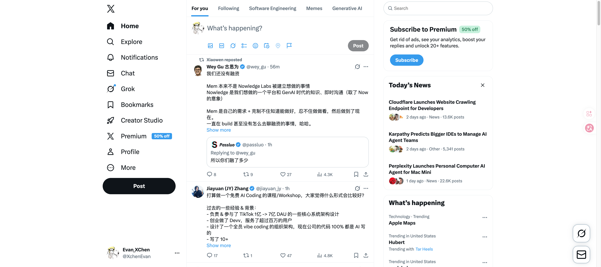

# YC Library Atlas

A local-first tracker for exploring the full YC Library in random order without losing your progress.



## What It Is

YC Library Atlas is for people who do not want a rigid curriculum.

You can wander through YC videos, blog posts, and external resources by mood,
capture whatever you opened, and keep a persistent record of:

- what you have seen
- what you have finished
- what is still untouched

It also keeps an optional draw and an optional fallback spine for days when you
want a nudge instead of pure randomness.

## Why This Exists

The YC Library is unusually good English material if you already like startup
content. The problem is not access. The problem is that random browsing usually
leaves no trail.

This repo solves that with a very small local setup:

- no deployment required
- file-backed progress in `progress.json`
- quick capture from YC page URLs, YouTube links, Spotify links, or title text
- one-click local launch on macOS

## Lightest Reliable Use

If this is just for yourself, you do not need to deploy it anywhere.

The lightest reliable path is:

1. Double-click `start.command`
2. The page opens at `http://127.0.0.1:8123`
3. Your history is saved to `progress.json`

If you prefer terminal:

```bash
cd /Users/evanmore/Documents/codex/yc-library-map
python3 server.py
```

Then visit `http://127.0.0.1:8123`.

If you open `index.html` directly, the app still works, but persistence falls
back to browser-local storage instead of the local JSON file.

## One-Click Logging From YC Pages

If you are browsing the real YC Library and want the lightest possible workflow,
use a bookmarklet.

Create a bookmark in your browser and paste this as the URL:

```text
javascript:(()=>{window.open('http://127.0.0.1:8123/index.html#capture='+encodeURIComponent(location.href)+'&action=sampled','yc-library-atlas');})();
```

When you are on a YC Library page, click that bookmark and the local atlas will
open or focus, match the current URL, and log it as seen.

If you want a "mark done" version too:

```text
javascript:(()=>{window.open('http://127.0.0.1:8123/index.html#capture='+encodeURIComponent(location.href)+'&action=done','yc-library-atlas');})();
```

## Project Structure

- `index.html`: the app shell
- `styles.css`: the visual system
- `app.js`: progress logic, filters, capture flow, and rendering
- `yc-library-data.js`: generated YC Library snapshot
- `progress.json`: durable study log written by the local server
- `server.py`: static server plus `/api/progress` for file-backed saves
- `start.command`: double-click launcher for local use on macOS
- `stop.command`: stops the local server on macOS
- `scripts/update_yc_library_data.py`: refreshes the YC Library snapshot

## Refresh The Data

```bash
cd /Users/evanmore/Documents/codex/yc-library-map
python3 scripts/update_yc_library_data.py
```

The script writes a fresh `yc-library-data.js` snapshot that the page reads on
load.
